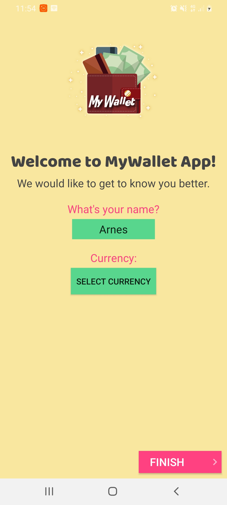
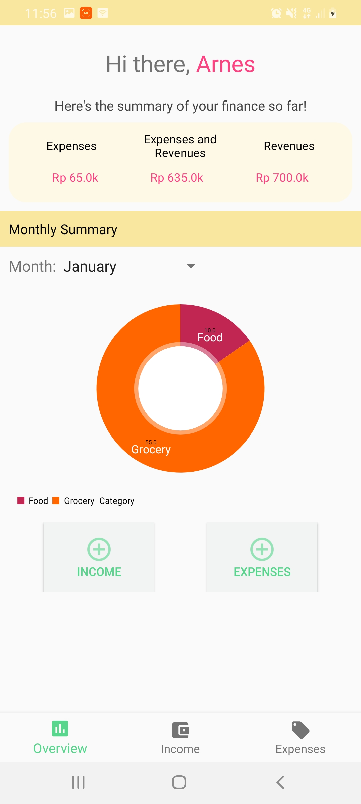
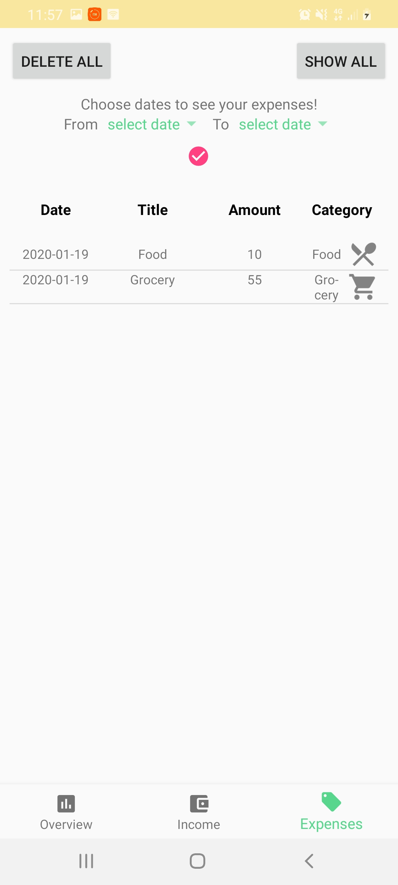

# my-wallet

MyWallet is a budgeting Android application for students to keep track of their finances!

The features included:

1. Select currencies
2. Add income and expenditure
3. Categorization of income and expenditure
4. Summary of finance depicted in a piechart based on the category
5. See expenditure and income history based on the chosen dates
6. Attractive user interface
